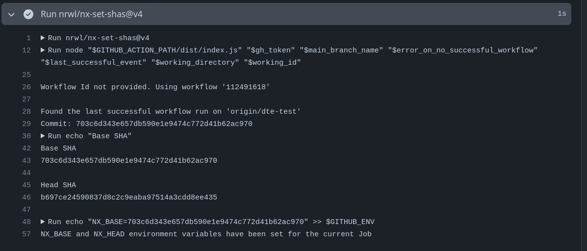

# Exercise: Affected Tweaks
In this exercise we'll learn how to configure the `affected` command to compare against different bases.

## 1. Compare affected between main and last commit in the branch
Most of the time, we want to compare against the last commit. We can do that by using the `--head=HEAD^` flag.

```bash
npx nx affected -t lint --base=main --head=HEAD^
```

## 2. Compare previous commit with last commit  in the current branch 
Sometimes we want to compare against the last commit in the current branch.
This way we can commit changes and see how the affected command behaves.

```bash
nx affected:lint --base=HEAD~1 --head=HEAD
```

<details>
  <summary>Details</summary> 

- `--base=HEAD~1`: Sets the base for comparison to the commit just before the current one (HEAD~1).
- `--head=HEAD`: Sets the head for comparison to the current commit (HEAD).

</details>

## 3. Introduce nrwl/nx-set-shas@v4 in pipeline

We want to use the `nrwl/nx-set-shas@v4` plugin in order to calculate the proper
`base` & `head` `hashes` from git to optimize the `affected` computation.

First, we need to remove the custom `--head=HEAD^` command we've used before.

```yaml
- name: Run commands in parallel
  run: npx nx affected -t lint build # 👈️ GONE!
```

Then, we introduce the `nrwl/nx-set-shas@v4` as a `uses` statement before running our commands

```yaml
- uses: nrwl/nx-set-shas@v4
  with:
    # The "main" branch of your repository (the base branch which you target with PRs).
    # Common names for this branch include main and master.
    #
    # Default: main
    main-branch-name: 'YOUR_BRANCH_NAME' # 👈️ 👈️👈️👈️👈️👈️ IMPORTANT !
```

<details>
  <summary>Adjusted main job</summary>

```yaml
  main:
    name: DTE Coordinator
    runs-on: ubuntu-latest
    env:
      NX_CLOUD_DISTRIBUTED_EXECUTION: true
      NX_DISTRIBUTED_TASK_EXECUTION: true

    steps:
      - uses: actions/checkout@v4
        with:
          fetch-depth: 0

      - uses: actions/setup-node@v3
        with:
          node-version: 20
          cache: 'npm'
      - run: npm ci
      
      - uses: nrwl/nx-set-shas@v4
        with:
          # The "main" branch of your repository (the base branch which you target with PRs).
          # Common names for this branch include main and master.
          #
          # Default: main
          main-branch-name: 'YOUR_BRANCH_NAME' # 👈️ 👈️👈️👈️👈️👈️ IMPORTANT !
      
      
      - name: Initialize the Nx Cloud distributed CI run
        run: npx nx-cloud start-ci-run --distribute-on="manual"

      - name: Run commands in parallel
        run: npx nx affected -t lint build # 👈️ GONE!

      - name: Stop Nx Cloud DTE agents
        if: ${{ always() }}
        run: npx nx-cloud stop-all-agents
```

</details>

## 4. Execute the pipeline

Change something and see how the plugin is doing its job and calculating the proper head and base arguments.


