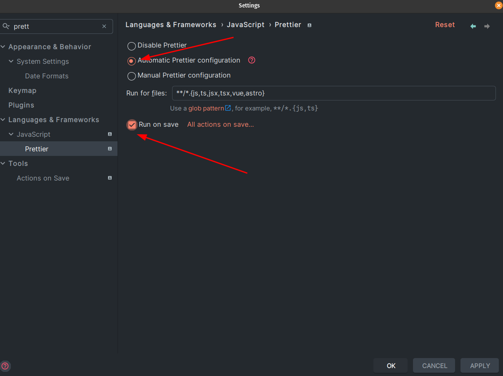
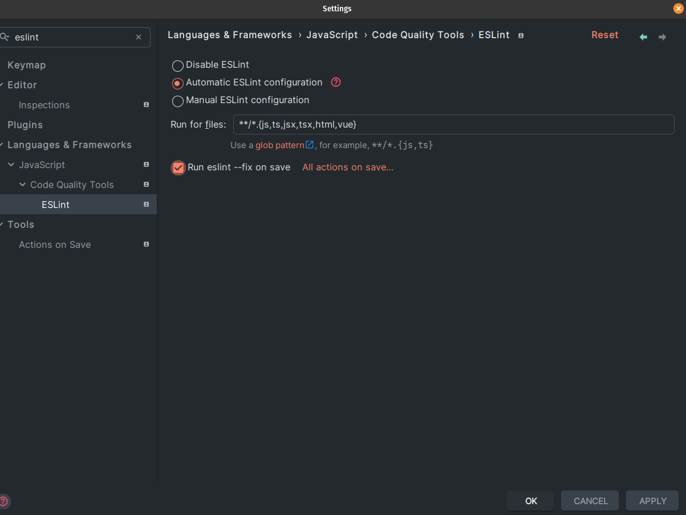

# Nx Code Quality & Consistency

In this exercise you'll learn how to achieve automatic code quality & consistency
checks whenever you change something in the code base.
You are going to setup `eslint` as well as `prettier` to automatically run on as
a pre-commit hook to make sure your shipped code always aligns to certain style guides.

## 0. Create a new branch please

As this exercise requires interaction with git, please create your own branch for this exercise.

You can use the following pattern: `solution/{your-name}`

```bash
git checkout -b solution/{your-name}
```

## 1. Get to know nx format

As a first step, get familiar with the `nx format` command. Under the hood, `nx format` uses
prettier to check or actually write changes to your code.

In order to check if your current codebase aligns to the configured presets, run the
following command.

```bash
nx format:check
```

If everything is good, there shouldn't be an outcome. Each file that potentially should
receive an update will be reported in your terminal.

> This is an extremely useful utility to introduce into your CI Pipeline.
> This way you can automatically reject code that doesn't align to your guidelines

In case you didn't get anything reported, go ahead an introduce 5 empty lines to any file and re-run the command from before.

In order to only check code that is currently in an uncommitted state, run

```bash
nx format:check --uncommitted
```

> This is very useful for pre-commit stages

Now, let's actually do formatting. Run the following command to kick things off.

```bash
nx format:write
```

Now prettier will format your code according to the configuration.


## 2. Install dependencies

As we've discussed before, we want to run those checks automatically before something
reaches our repository and without having devs to hustle around with that.

We are going to use `lint-staged` as well as `husky` in order to setup our automatic
code quality checks.

Please go ahead and install both of them as dev dependencies.

```bash
npm install lint-staged husky --save-dev
```

## 3. Setup husky

As a first step for our automation to work, we want to introduce [`husky`](https://github.com/typicode/husky) as a dev dependency to our project.
Husky is a tool that lets us setup git hooks to run arbitrary commands on certain git events.

As we want to protect our repository from being flooded with unformatted code, we are interested in a pre-commit hook.
Let's set it up.

### Installation

The first thing we need to do is to make sure husky always installs itself properly on each client. For this we'll use the
`npm prepare` stage.

By running the following command you'll make husky install itself via npm.

```bash
npm pkg set scripts.prepare="husky install"
```

Now also run the prepare stage, so it gets properly installed on your system.

```bash
npm prepare
```

### Hook setup

Now it's time to configure the pre-commit hook.

Run the following command to set `lint-staged` as a pre-commit hook for husky.

```bash
npx husky add .husky/pre-commit "npx lint-staged"

git add .husky/pre-commit
```

Great, we are all set for the final step to make our pre-commit hook actually
usable.

## 4. Setup lint-staged

[`lint-staged`](https://github.com/lint-staged/lint-staged) let's use run operations on files that are currently being 
staged by git. So just before they are going to be committed. If the operation fails, the commit will be rejected.

Typically, lint-staged will be configured directly in your `package.json`.

Introduce a `lint-staged: {}` key in your package.json file. Each key
of this object represents a regex for files, the value the corresponding command
to execute for files that match the regex.

```json
{
  "lint-staged": {
    "some-regex": "command-to-execute"
  }
}
```

Our example will be quite simple, we want to run `prettier` as well as `eslint`
for all `js, ts, html` file in our project.

As `scss, json, md` files cannot get linted, only prettier should run for them.

We can either use `prettier` & `eslint` directly, or make use of the `nx affected` commands.

Choose what fits best for your own project, it can heavily affect performance!

> If you are using the nx commands, make sure to also use the `--uncommitted` flag

<details>
  <summary>Solution: Plain commands</summary>

```json
// package.json
{
  "lint-staged": {
    "**/*.{ts,js,html}": [
      "eslint --fix --quiet"
    ],
    "**/*.{ts,js,html,scss,md,mdx,json}": [
      "prettier --write"
    ]
  }
}
```

</details>

<details>
  <summary>Solution: Nx commands</summary>

```json
// package.json
{
  "lint-staged": {
    "**/*.{ts,js,html}": [
      "nx affected:lint --uncommitted --fix --quiet"
    ],
    "**/*.{ts,js,html,scss,md,json}": [
      "nx format:write --uncommitted"
    ]
  }
}
```

</details>

Please go ahead and test out both solutions.

You should see a difference in the amount of executed tasks when changing code in a library that is heavily used, e.g. some of the ui libs.

Make sure you've got any uncommitted change in your codebase.

Run `git commit -m "le-message"` and watch the console executing your defined commands.

Please test out a scenario where your commit is being rejected!

## 5. Setup your IDE

You are also able to let your IDE run prettier as well as eslint on code changes.
Depending on your habits this can be quite helpful as you have less manual changes to apply.

### IntelliJ based products

#### Prettier 

Open the `Settings` and search for `prettier`. Make sure to have it enabled 
as well as have it run on save. See the following screenshot



#### Eslint

The same approach can be done for eslint, see the following screenshot.



### VSCode

Open the `settings.json` using `ctrl + shift + p` and search for `settings.json`, select  `Open User Settings (JSON)`.

Add the following configuration to your settings.json file.

```json
{
  "editor.formatOnSave": true,
  "editor.codeActionsOnSave": {
    "source.fixAll.eslint": true
  }
}
```

