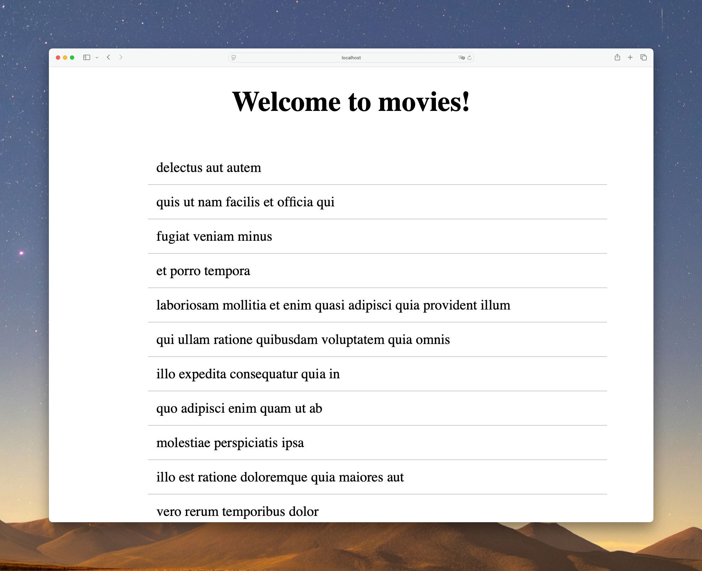
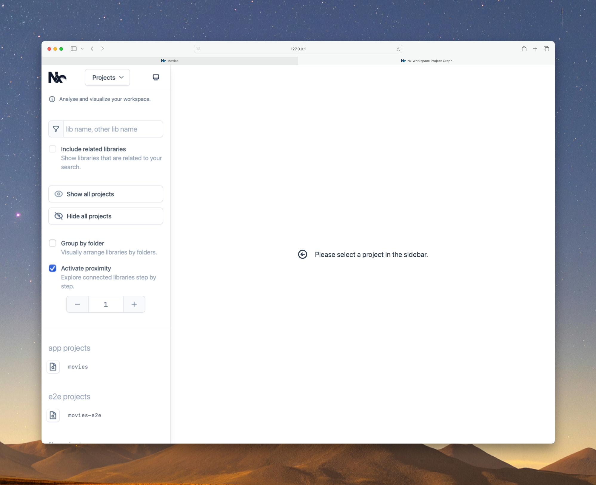
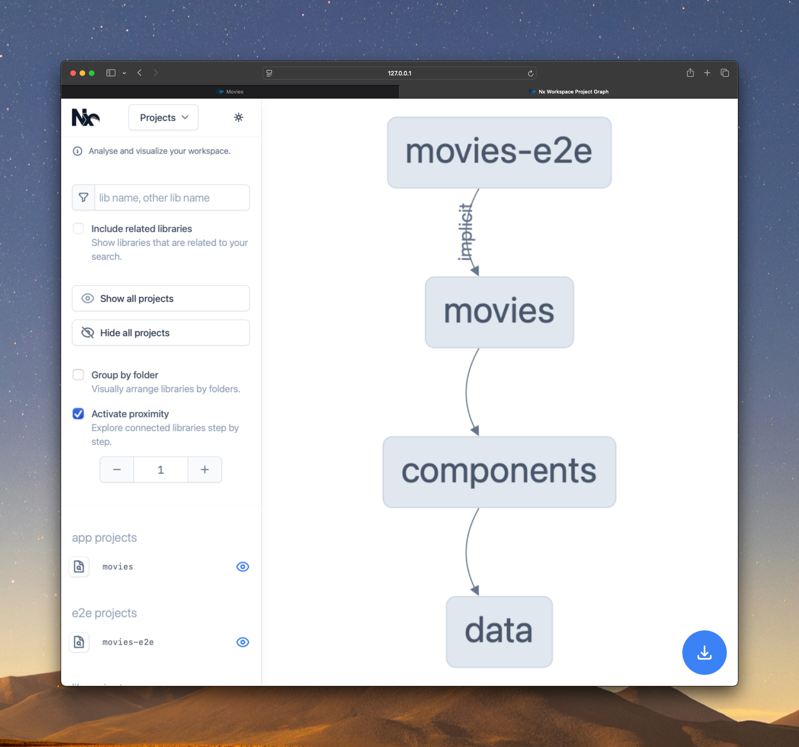
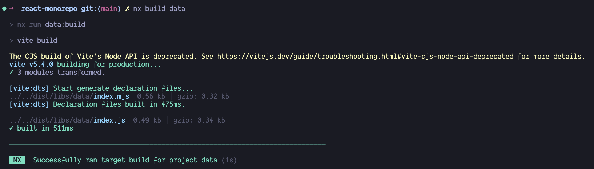
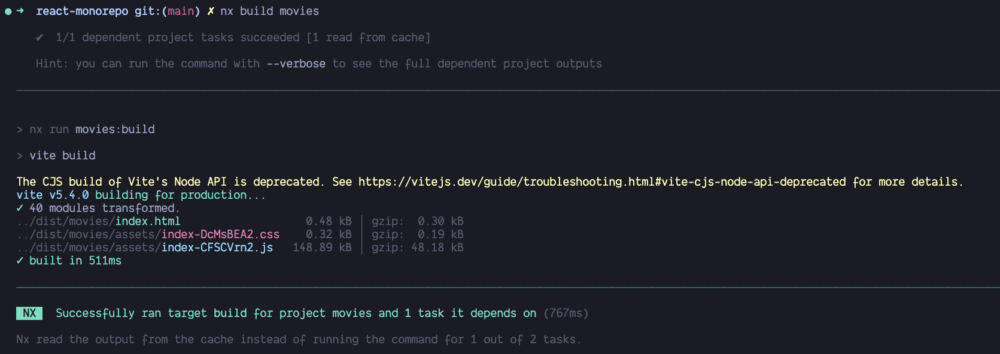
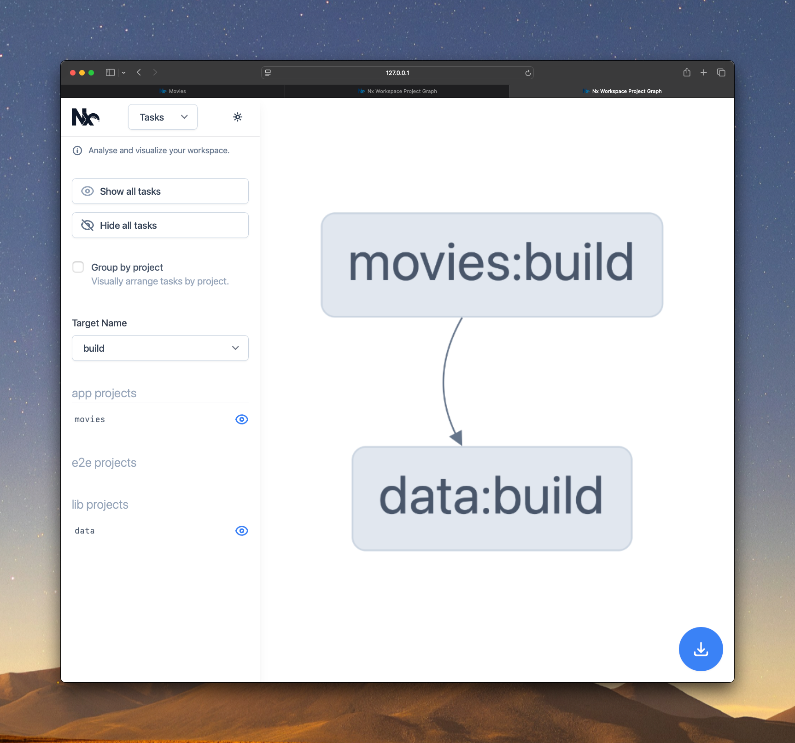

# Exercise: Create Libs

In this exercise, we will create some libraries that we can use in our application.
We will create different types of libraries, that serve different purposes in our application.

The end-goal should be to have two libraries that are **somehow** (we'll figure out in the end) imported
into the `movies` application.

> [!NOTE]
> The following roadmap guides you through the creation of two libraries that involve 
> fetching movie data & displaying a list of them.
> You can fully opt-out of the described scenario and entirely build something else.

In the end you should run the `nx graph` and see how your imports are analyzed and understood by nx.
You can also inspect the `--graph` option to see how your executors are tied together.

> [!TIP]
> REMEMBER THE `nx g rm` command. In case you've messed up, you can simply delete libraries!

## 1. Create a library for data

First, we will create a library which will store our interfaces and data fetching logic.
For this, we will use the `@nx/react` plugin which is already installed in our workspace.

Remember how the commands are structured, `nx generate ${plugin}:${type} ${name}`:

> [!NOTE]
> The following options are only suggestions, you can of course play around
> with other options how you would like to approach it.

* choose `libs/data` as directory
* choose `data` as name
* **bundler**: `vite`

<details>
  <summary>Generate Data Buildable Lib</summary>

```bash
npx nx generate @nx/react:library data --bundler=vite --directory=libs/data --projectNameAndRootFormat=as-provided
```

> It will ask you about choosing a test runner, so make sure to choose `none` (we can skip tests for the moment).

By, default, the library directory will look like this:
```
libs
├── data
│   ├── src
│   │   ├── lib
│   │   │   ├── data.tsx
│   │   │   └── data.module.scss
│   │   └── index.ts
│   ├── .babelrc
│   ├── .eslintrc.json
│   ├── package.json
│   ├── project.json
│   ├── tsconfig.json
│   ├── vite.config.ts
│   ├── tsconfig.lib.json
│   └── README.md
```

> Remove `data.tsx` & `data.module.scss` files, because we will generate a new one.

</details>


### Add some meaningful code to the `data` library.

- Add an interface and export it
  
  <details>
    <summary>Add `Movie` interface and export it</summary>
  
  Create a file `libs/data/src/lib/movie.model.ts` and add the following code:
  
  ```ts 
  export interface Movie {
    id: string;
    title: string;
  }
  ```
  
  Export everything from the file, in the `index.ts` file.
  
  ```ts index.ts
  export * from './lib/movie.model';
  ```
  
  </details>

- Add a hook to fetch data from the API and export it

  <details>
    <summary>Add `useFetchMovies` hook and export it</summary>

  Create a file `libs/data/src/lib/use-fetch-movies.ts` and add the following code:

  ```ts   
  import { Movie } from "./movie.model";
  import { useState, useEffect } from 'react';
  
  export function useFetchMovies() {
    const [movies, setMovies] = useState<Movie[]>([]);
    const [isLoading, setIsLoading] = useState(true);
    const [error, setError] = useState<string | null>(null);
  
    useEffect(() => {
      const fetchMovies = async () => {
        try {
          const response = await fetch('https://jsonplaceholder.typicode.com/todos'); // Replace with your actual API endpoint
          if (!response.ok) {
            throw new Error('Failed to fetch movies'); 
          }
          const data = await response.json() as Movie[];
          setMovies(data);
        } catch (err) {
          setError('Failed to fetch movies');
        } finally {
          setIsLoading(false);
        }
      };
  
      fetchMovies();
    }, []); // Empty dependency array ensures the effect runs only once after initial render
  
    return { movies, isLoading, error };
  }
  
  export default useFetchMovies;
  ```

  Export everything from the file, in the `index.ts` file.

  ```ts index.ts
  export * from './lib/movie.model';
  export * from './lib/use-fetch-movies';
  ```

  </details>

## 2. Create a library for components
Next, we will create a `React` library which contains a component that will display the movies.

* choose `libs/components` as directory
* choose `components` as name
* **bundler**: `none`

<details>
  <summary>Generate Components Lib</summary>

```bash
npx nx generate @nx/react:library --name=components --bundler=none --unit-test-runner=jest --directory=libs/components --projectNameAndRootFormat=as-provided 
```

By, default, the library directory will look like this:
```
libs
├── components
│   ├── src
│   │   ├── lib
│   │   │   ├── components.module.scss
│   │   │   ├── components.spec.tsx
│   │   │   └── components.tsx
│   │   └── index.ts
│   ├── .babelrc
│   ├── .eslintrc.json
│   ├── jest.config.ts
│   ├── project.json
│   ├── tsconfig.json
│   ├── tsconfig.lib.json
│   ├── tsconfig.spec.json
│   └── README.md
```

One thing to note is that this library doesn't have a `package.json` file or `vite.config.ts` file, because this is not a buildable library.

> Remove `components.tsx`, `components.spec.ts` & `components.module.scss` files, because we will generate a new one.

</details>

### 2.1 Create MovieList using a generator
Create a `MovieList` component in the `components` library.

<details>
  <summary>Generate `MovieList` component</summary>

```bash
npx nx generate @nx/react:component --name=MovieList --directory=libs/components/src/lib/movie-list --export --projectNameAndRootFormat=as-provided
```

This will generate a `MovieList` component in the `components` library, which will be exported from the `index.ts` file.

```
lib/movie-list
├── MovieList.tsx
├── MovieList.spec.scss
└── MovieList.module.scss
```

> [!NOTE]
> Don't forget to update the `index.ts` file to remove the old imports that we removed in the previous step.


</details>

### 2.2 Update the `MovieList` component to use the `useFetchMovies` hook
Inside `MovieList` component, we want to use the `useFetchMovies` hook to fetch the movies.

<details>
  <summary>Update `MovieList` component</summary>

Open the `MovieList.tsx` file and replace its content with the following code:

```tsx
import { useFetchMovies } from '@react-monorepo/data';
import styles from './MovieList.module.scss';

export function MovieList() {
  const { movies, isLoading, error } = useFetchMovies();

  return (
    <div className={styles['movie-list']}>
      {isLoading ? (
        <p>Loading...</p>
      ) : error ? (
        <p>Error: {error}</p>
      ) : (
        <ul>
          {movies.map((movie) => (
            <li key={movie.id} className={styles['movie-item']}>
              <span>{movie.title}</span>
            </li>
          ))}
        </ul>
      )}
    </div>
  );
}
```

Update the `MovieList.module.scss` file to include the following styles:

```scss
.movie-list {
  display: flex;
  flex-direction: column;
  align-items: center;
  justify-content: center;
  height: 100%;
}

.movie-item {
  display: flex;
  flex-direction: row;
  align-items: center;
  justify-content: space-between;
  width: 100%;
  padding: 10px;
  border-bottom: 1px solid #ccc;

  &:last-child {
    border-bottom: none;
  }
}
```

</details>

### 2.3 Use the `MovieList` component in the `App` component
Now that we have a `MovieList` component, use it in the `App` component.

<details>
  <summary>Use `MovieList` component in `App`</summary>

Open the `movies/src/app/app.tsx` file and replace its content with the following code:

```tsx
// 👇 import MovieList from the components library
import { MovieList } from '@react-monorepo/components';

export default function App() {
  return (
    <div className="app">
      <h1 style={{ textAlign: 'center' }}>Welcome movies!</h1>
      {/* 👇 use MovieList component */}
      <MovieList />
    </div>
  );
}
```

</details>

### 2.4 Run the application
Run the application by executing the following command:

```bash
npx nx serve movies
```

<details>
  <summary>Example Output</summary>

You should see the following output:



</details>

## 3. See project graph
In order to get a better understanding of the project structure we just built, we can use the `nx graph` command.

```bash
npx nx graph
```

<details>
  <summary>Example Project Graph</summary>

The output should look like this:


Click on `Show all projects` to see the full project graph.

You should see something like this:


</details>

## 4. Build & Task Graph
When we created the `data` library, we passed the `--bundler=vite` flag to the `nx generate` command.
By doing this, we created a buildable library. That means that we can run the `build` target to build the library.

### 4.1 Run Build for the `data` library

<details>
  <summary>Build `data` library</summary> 

The command to build the `data` library is the same as the one we used to build the `movies` app, but with the `data` library as the target.

```bash
npx nx build data
```

You should see the following output:



</details>

### 4.2 Run build for `movies` app

Because we are using the `data` library in the `movies` app, that means that `movies` app build depends on the `data` library build.
So, when we run the `build` target for the `movies` app, it will also build the `data` library.

<details>
  <summary>Build movies</summary>

```bash
npx nx build movies
```

It first, will build the `data` library, and then the `movies` app.

Because, we already run the `build` for the `data` library, the result will look like this:



So, you can see that movies app depends on the `data` library build.
But, we can also see that the build for that was read from the cache.

</details>


### 4.3 Examine Build Graph
Just like the project graph we saw before, we can also see the build graph.
The build graph shows us the dependencies between the different targets and not just the projects.

<details>
  <summary>Examine Build Graph</summary>

```bash
npx nx run-many --target build --graph
```

The output should look like this:


Basically, we can see that the `build` target for the `movies` app depends on the `build` target for the `data` library.

</details>
