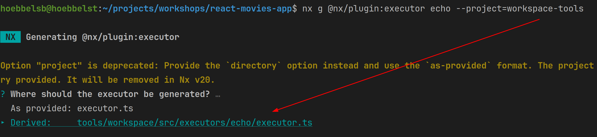

# Nx Custom Executor

Learn how to create a custom executor with Nx for enhancing your project setup. 
This guide covers generating a plugin, adopting a custom configuration, and executing the executor to streamline development processes.

You are going to create a custom Nx executor to run the `deploy` configuration in your project, ensuring conventions
and making the deploy progress accessible for other projects.


# 1. Generate an executor

The first thing we need to do is to generate ourselves a generator. We of course want to do create the generator
as part of our plugin `workspace-tools` that we've created before.

Use the `@nx/plugin:executor` generator to generate a new `deploy` executor.

Use the `--director=tools/workspace/src/executors/deploy` argument to specify it as a target for the existing plugin.

<details>
  <summary>generate the deploy executor</summary>

```bash

npx nx g @nx/plugin:executor deploy --directory=tools/workspace/src/executors/deploy 


```

</details>



Cool, now you've got the skeleton setup and running.

# 2. Make the generator configurable

Our generator should take 2 arguments:
* `dockerFile` -> a path to the dockerFile
* `tag` -> a tag for the docker build to be used

Both of them should be required.

In order to do so, open the `/tools/workspace/src/executors/deploy/schema.json` and configure
the two properties and mark them as required.

<details>
  <summary>Configure executor schema</summary>

```json

{
  "properties": {
    "dockerFile": {
      "type": "string",
      "description": "path to dockerfile"
    },
    "tag": {
      "type": "string",
      "description": "tag for the docker container"
    }
  },
  "required": ["dockerFile", "tag"]
}

```

</details>

Great! Now, let's also update the type definition, sitting right next to it:
`schema.d.ts`:

<details>
  <summary>Adjust the schema types</summary>

```ts

export interface DeployExecutorSchema {
  dockerFile: string;
  tag: string;
}

```

</details>

Nicely done! We can go ahead an implement our generator!

# 3. Implement some babysteps

Now open the executor file at `/tools/workspace/src/executors/deploy/executor.ts`

Use the `logger` from `@nx/devkit` to print out a logging message with the arguments.

<details>
  <summary>log in executor</summary>

```ts

import { logger, PromiseExecutor } from '@nx/devkit';

const runExecutor: PromiseExecutor<DeployExecutorSchema> = async (
  options,
  context
) => {
  const projectName = context.projectName;

  logger.log('logging something', options);
  
  return {
    success: true
  }
};

export default runExecutor;


```

</details>

# 4. Use & Execute it

## 4.0 Build the plugin

This is something that has to be done! We need to build the plugin before we can use it!

```bash
npx nx build workspace-tools
```

## 4.1 Configure it as an executor

Now let's open the `apps/movies/project.json` and configure the `deploy` target to use our new
executor!

<details>
  <summary>project.json</summary>

```json
{
  "targets": {
    "deploy": {
      "executor": "@react-monorepo/workspace-tools:deploy",
      "options": {
        "dockerFile": "tools/deploy/frontend.Dockerfile",
        "tag": "ghcr.io/push-based/react-movies-app/react-movies-app:dev"
      }
    }
  }
}
```

</details>

## 4.2 Execute it

Finally, we also want to execute it:

```bash
npx nx run movies:deploy
```

You should see your logging message there!

# 5. Build the real thing

Let's get back to the executor file at `/tools/workspace/src/executors/deploy/executor.ts`

## 5.1 The simple thing, but error prone!

Remember what we want to do! We want to execute the following command, whenever our executer
is actually executed.

```js
`docker build -f ${options.dockerFile} --build-arg='APP_NAME=${projectName}' . -t ${options.tag}`
```

In order to do this, we are going we use the `exec` helper from `node:child_process`!

Your task will be, to use the `import { exec } from 'node_child_process'` in order to
run the command shown above.

<details>
  <summary>The simple executor</summary>

```ts
// /tools/workspace/src/executors/deploy/executor.ts

import { logger, PromiseExecutor } from '@nx/devkit';
import { DeployExecutorSchema } from './schema';
import { exec } from 'node:child_process';

const runExecutor: PromiseExecutor<DeployExecutorSchema> = async (options, context) => {
  logger.log('logging something', options);
  const projectName = context.projectName;
  exec(
    `docker build -f ${options.dockerFile} --build-arg='APP_NAME=${projectName}' . -t ${options.tag}`
  );
  return {
    success: true,
  };
};
```

</details>

Congratulations! Please make sure to also run your executor:

```bash
npx nx run movies:deploy
```


## 5.2 OPTIONAL: The full thing, with error checking!

> [!NOTE]
> some bins will spit out their logs to the `stderr` instead of `stdout`.
> This is also the case for `docker`.

So we are using `promisify` from `node:utils` to make a `Promise` out of our
`exec`.

```ts
import { logger, PromiseExecutor } from '@nx/devkit';

import { DeployExecutorSchema } from './schema';

import { promisify } from 'node:util';
import { exec } from 'node:child_process';

// 👇️👇️👇️👇️👇️👇️👇️

const asyncExec = promisify(exec);
```

Ok, everything is setup. Let's introduce a `try { await exec() } catch() {}` and
use it to log out any errors.

We also want to use the `stderr` to print out any progress.

So this is the core piece to inject into the executor:

```ts
try {
  const { stderr } = await asyncExec(
    `docker build -f ${options.dockerFile} --build-arg='APP_NAME=${projectName}' . -t ${options.tag}`
  );
  logger.log(stderr);
  logger.log('thank you for deploying with austrian airlines');
  return {
    success: true,
  };
} catch (e) {
  logger.error(e.message);
  return {
    success: false,
  };
}
```

<details>
  <summary>Full solution</summary>

```ts

// exectuor
import { logger, PromiseExecutor } from '@nx/devkit';

import { DeployExecutorSchema } from './schema';

import { promisify } from 'node:util';
import { exec } from 'node:child_process';

const asyncExec = promisify(exec);

const runExecutor: PromiseExecutor<DeployExecutorSchema> = async (
  options,
  context
) => {
  const projectName = context.projectName;
  try {
    const { stderr } = await asyncExec(
      `docker build -f ${options.dockerFile} --build-arg='APP_NAME=${projectName}' . -t ${options.tag}`
    );
    logger.log(stderr);
    logger.log('thank you for deploying with austrian airlines');
    return {
      success: true,
    };
  } catch (e) {
    logger.error(e.message);
    return {
      success: false,
    };
  }
};

export default runExecutor;

```

</details>

Congratulations! Please make sure to also run your executor:

```bash
npx nx run movies:deploy
```

You should see all the outputs from docker as before!
