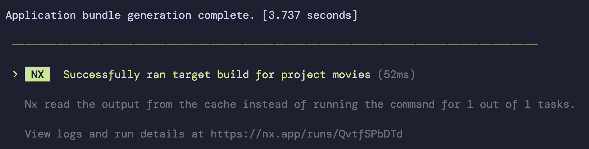

# Nx Replay

In this exercise you'll get to know the power of nx distributed caching.

## 1. Recap Local Cache

First, let's recap the nxs local cache. It is already enabled by default and you can confirm
by taking a look at your `nx.json`. In the `targetDefaults` section, you'll find `cache: true`.

```json
{
  "targetDefaults": {
    "build": {
      "cache": true // <-- local cache enabled
    }
  }
}
```

Please do a change in your codebase and run `nx build movies`. It will start the build process for your application.
After it is finished, repeat the step.

You should notice the build is running significantly faster than before.
Your terminal should output the following statement:

`> nx run movies:build:production  [existing outputs match the cache, left as is]`

## 2. Find a Cache Consumer ;-)

Find yourself someone in the room who is willing to be your cache consumer :-). Everyone should follow
all steps of this exercise. But please let someone other than yourself also check out your branch, experience the cache
and vice versa.
This part of the exercise is more fun doing with someone else.

## 3. Distributed Caching

Local cache is cool, however, your team & your infrastructure will still build the very
same artifacts over and over again. We can mitigate this issue by sharing
a cache between all stakeholders.

### 3.1 Create and distribute your cache

Now do changes to your code base and push everything to your branch.

Make sure to perform at least a `nx build movies` run.

You'll notice the outcome of the build is stating some details about the cloud cache.
You'll also find a link that gives you more information about your run.



Tell the name of your branch to your partner you've searched before
and let him or her pull your changes. Then they should also perform a build.

```bash
nx build movies
```

You should notice the build on the other computer was instant as the cloud cache delivered the result 
immediately. It'll also give the same detail information about the nx cloud run.

Now you all can follow the link and inspect the dashboard :-)

