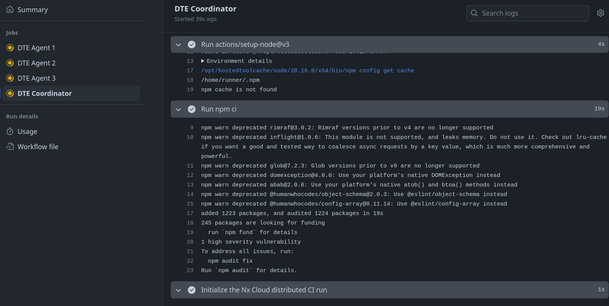

# Exercise: Nx Agents & DTE

In this exercise we'll learn how to use nx agents and distributed task execution.

In the end we'll have a CI that is able to distribute tasks between multiple self hosted
machines with the help of nx.



## 1. Introduce task distribution

Open the `.github/workflows/ci.yml` file, this will be everything you need
for this exercise.

### 1.1 configure ci concurrency

That's something we have to configure for githubs sake. Add a `concurrency`
section to your yaml configuration, just below the `on` config.


<details>
  <summary>concurrency setting</summary>

```yml

on:
  push:
    branches:
      - YOUR_BRANCH # 👈️👈️👈️👈️👈️👈️👈️ IMPORTANT !!!
  #pull_request:

concurrency:
  # Group concurrency on workflow, then:
  # - Is merge run? Group on branch name (`refs/heads/main`)
  # - Is pull request? Group on pull request branch name, for example `feat/add-awesome-feature`
  group: >-
    ${{ github.workflow }}-${{
      github.event_name == 'push'
        && github.ref
        || github.head_ref
    }}
  # Run merge workflows in sequence to prevent parallel deployments and releases
  # Cancel stale pull request runs in progress for the same branch
  cancel-in-progress: ${{ github.event_name != 'push' }}

```

</details>

### 1.2 introduce new job: `dte_agents`

Add a new `dte_agents` job section that declares our machines based on a given matrix.

The skeleton should just be able to spawn up to three agents based on the following strategy

The `[1, 2]` defines how many agents to spawn. Please don't overdo it here. Keep it small!

```yaml
    name: DTE Agent ${{ matrix.agent }}
    strategy:
      matrix:
        agent: [1, 2]
```

<details>
  <summary>dte_agents configuration</summary>

```yaml

jobs:
  dte_agents:
    name: DTE Agent ${{ matrix.agent }}
    runs-on: ubuntu-latest
    timeout-minutes: 20

    strategy:
      matrix:
        agent: [1, 2]

```

</details>


Now we also need to tell the agent what to do. It's quite the same as we do in the main job.

We need to:
* `checkout`
* `setup-node`
* `npm ci`

Plus we have to call `npx nx-cloud start-agent` as a last step.

Add the following snippets as `steps` section in your agent configuration:

```yaml
jobs:
  dte_agents:
    name: DTE Agent ${{ matrix.agent }}
    runs-on: ubuntu-latest
    timeout-minutes: 20

    strategy:
      matrix:
        # Must match the argument passed to `nx-cloud --agent-count` in the main job
        agent: [1, 2, 3]
    steps:
      # 👈️👈️👈️👈️👈️

```

```yaml
 - uses: actions/checkout@v4
```

```yaml
- uses: actions/setup-node@v3
  with:
    node-version: 20
    cache: 'npm'
- run: npm ci
```

```yaml
- name: Start Nx Cloud DTE Agent
  run: npx nx-cloud start-agent
  env:
    NX_AGENT_NAME: ${{ matrix.agent }}
```

<details>
  <summary>full dte_agents</summary>

```yaml

jobs:
  dte_agents:
    name: DTE Agent ${{ matrix.agent }}
    runs-on: ubuntu-latest
    timeout-minutes: 20
    
    strategy:
      matrix:
        # Must match the argument passed to `nx-cloud --agent-count` in the dte_coordinator job
        agent: [1, 2, 3]

    steps:
      - uses: actions/checkout@v4

      - uses: actions/setup-node@v3
        with:
          node-version: 20
          cache: 'npm'
      - run: npm ci

      - name: Start Nx Cloud DTE Agent
        run: npx nx-cloud start-agent
        env:
          NX_AGENT_NAME: ${{ matrix.agent }}

```

</details>

### 1.3 setup main job (the coordinator)

Now it's time to setup the coordinator, our existing `main` step.

In order to make it a coordinator, we need to make it run 
`npx nx-cloud start-ci-run` before we run our `nx affected` commands.
And also make it run `npx nx-cloud stop-all-agents` after we've finished the whole process.

#### 1.3.0 set env

We should configure specific NX env variables for this job specifically:

```yaml
 env:
    NX_CLOUD_DISTRIBUTED_EXECUTION: true
    NX_DISTRIBUTED_TASK_EXECUTION: true
```

#### 1.3.1 start the nx cloud ci run

Insert the following step before the existing `npx affected` command:

```yaml
      - name: Initialize the Nx Cloud distributed CI run
        run: npx nx-cloud start-ci-run --distribute-on="manual"
```

#### 1.3.2 stop the nx cloud ci run

Insert this snippet after the `npx affected` command.

```yaml
      - name: Stop Nx Cloud DTE agents
        if: ${{ always() }}
        run: npx nx-cloud stop-all-agents
```

<details>
  <summary>Full `main` -> coordinator job</summary>

```yaml

jobs:
  main:
  name: DTE Coordinator
  runs-on: ubuntu-latest
  env:
    NX_CLOUD_DISTRIBUTED_EXECUTION: true
    NX_DISTRIBUTED_TASK_EXECUTION: true

  steps:
    - uses: actions/checkout@v4
      with:
        fetch-depth: 0

    - uses: actions/setup-node@v3
      with:
        node-version: 20
        cache: 'npm'
    - run: npm ci

    - name: Initialize the Nx Cloud distributed CI run
      run: npx nx-cloud start-ci-run --distribute-on="manual"

    - name: Run commands in parallel
      run: npx nx affected -t lint build --base=HEAD^

    - name: Stop Nx Cloud DTE agents
      if: ${{ always() }}
      run: npx nx-cloud stop-all-agents

```

</details>

### 1.4 set the nx cloud env

We need to set the `NX_CLOUD_DISTRIBUTED_EXECUTION` to `true` & also the 
`NX_CLOUD_DISTRIBUTED_EXECUTION_AGENT_COUNT` to a number value that tells nx how many
agents it should expect. This value should match the value of the `matrix` configured
for the `dte_agents`.

## 2. Make your code base affected

Of course, as always. Play around with different change sets and run your newly
created wonderful CI environment.

Make it fail, make it pass. Do as you please.

Inspect the detailed outputs of each agent & also watch the nx cloud dashboard
giving you information about what happened.

## 3. Distributed Caching

Of course play around with the distributed caching. Make sure to produce the 
cache locally once and let the CI enjoy having nothing to do :).


## 4. Full Solution

```yaml
name: CI

on:
  push:
    branches:
      - YOUR_BRANCH # 👈️👈️👈️👈️👈️👈️👈️ IMPORTANT !!!
  #pull_request:


concurrency:
  # Group concurrency on workflow, then:
  # - Is merge run? Group on branch name (`refs/heads/main`)
  # - Is pull request? Group on pull request branch name, for example `feat/add-awesome-feature`
  group: >-
    ${{ github.workflow }}-${{
      github.event_name == 'push'
        && github.ref
        || github.head_ref
    }}
  # Run merge workflows in sequence to prevent parallel deployments and releases
  # Cancel stale pull request runs in progress for the same branch
  cancel-in-progress: ${{ github.event_name != 'push' }}

env:
  NX_CLOUD_DISTRIBUTED_EXECUTION: true # this enables DTE
  #NX_DISTRIBUTED_TASK_EXECUTION: true
  NX_CLOUD_DISTRIBUTED_EXECUTION_AGENT_COUNT: 2 # expected number of agents

jobs:
  dte_agents:
    name: DTE Agent ${{ matrix.agent }}
    runs-on: ubuntu-latest
    timeout-minutes: 20

    # The Free GitHub plan has a limit of 20 concurrent jobs on Ubuntu images
    # Reference: https://docs.github.com/en/actions/learn-github-actions/usage-limits-billing-and-administration
    # If we need to, we can optimize for 2 simultaneous workflow runs:
    # 2 x 1 main job   =  2 concurrent jobs
    # 2 x 9 agent jobs = 18 concurrent jobs
    # Total            = 20 concurrent jobs
    #
    # However, we don't have many projects or targets in this workspace, so we
    # lower the number of agents to reduce spent compute time.
    strategy:
      matrix:
        # Must match the argument passed to `nx-cloud --agent-count` in the dte_coordinator job
        agent: [1, 2]

    steps:
      - uses: actions/checkout@v4

      - uses: actions/setup-node@v3
        with:
          node-version: 20
          cache: 'npm'
      - run: npm ci

      - name: Start Nx Cloud DTE Agent
        run: npx nx-cloud start-agent
        env:
          NX_AGENT_NAME: ${{ matrix.agent }}

  # We're using Nx Cloud for Distributed Task Execution
  # Reference: https://nx.dev/using-nx/dte
  #
  # The coordinator outputs the combination of task outputs from the agents,
  # both terminal and file outputs
  main:
    name: DTE Coordinator
    runs-on: ubuntu-latest
    env:
      NX_CLOUD_DISTRIBUTED_EXECUTION: true
      NX_DISTRIBUTED_TASK_EXECUTION: true

    steps:
      - uses: actions/checkout@v4
        with:
          fetch-depth: 0

      - uses: actions/setup-node@v3
        with:
          node-version: 20
          cache: 'npm'
      - run: npm ci

      - name: Initialize the Nx Cloud distributed CI run
        run: npx nx-cloud start-ci-run --distribute-on="manual"

      - name: Run commands in parallel
        run: npx nx affected -t lint build --base=HEAD^

      - name: Stop Nx Cloud DTE agents
        if: ${{ always() }}
        run: npx nx-cloud stop-all-agents
```
