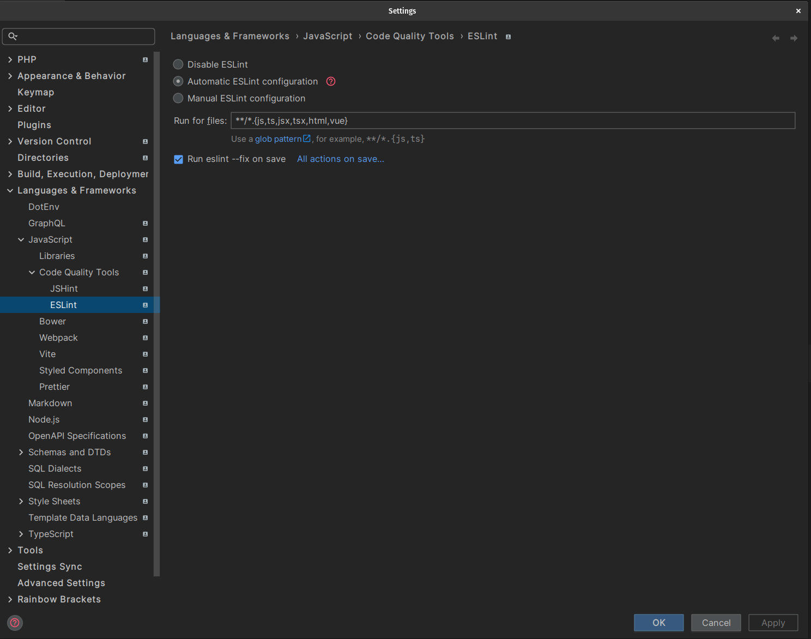
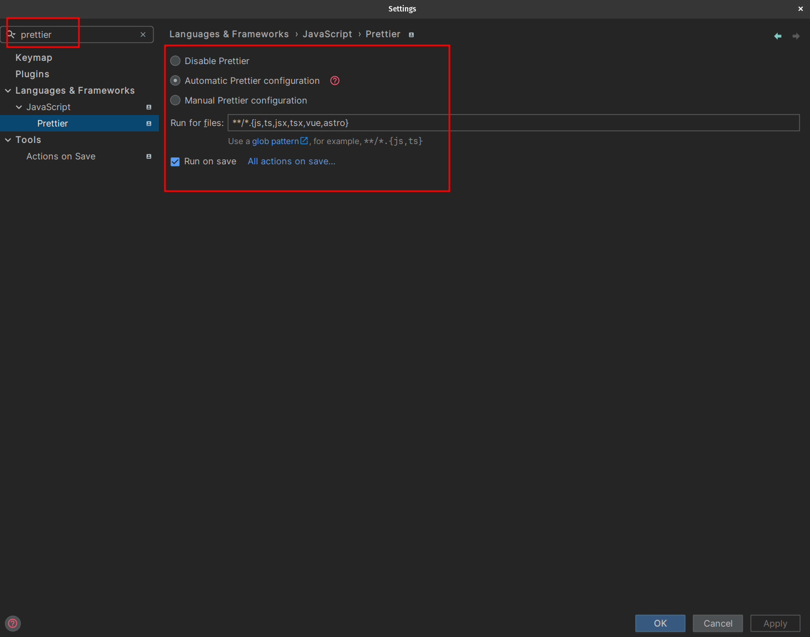

# Exercise: project setup

This exercise is here to make sure your setup is properly configured so that you don't run into any issues
when doing the actual coding exercises.

## 0. Required Software

### 0.1 Node & Npm

Make sure you have correct `node` * `npm` version

* `node ^20.11.1 || ^22.0.0`
* `npm > 10`

e.g.
```bash
node -v
v20.11.1

npm -v 
10.2.4

```

### 0.2 Docker installation (kind of optional)

We don't need you to have **ANY** knowledge about docker. But in order to have
a somewhat real life deploy example, we are using docker as a tool.

Please make sure you have docker installed on your system. In case you don't,
it's as simple as installing docker desktop and you are done.

Please follow the link https://www.docker.com/products/docker-desktop/ and install the docker desktop
client on your system.


### 0.3 Github access

Your instructors either already have, or will ask you to provide your github username. This way
we can invite you to the demo repository so that you are able to create pull requests
on your own.

Please make sure your local git is setup correctly and you are providing
the correct username to the instructors.

## 1. Clone & Install


```bash
git clone https://github.com/push-based/react-movies-app.git

cd react-movies-app

npm install

# (optional) if the step before didn't work, please try the following
npm install --force
```

### 1.1 [OPTIONAL]: Install global cli

> [!NOTE]
> If you don't do this exercise, you can always use `npx` instead.
> `npx nx ...`.

First of all, check if you already have a version installed

```bash
nx --version
```

Check if the version matches the current latest version `19.x.x`.

If so, you can skip the installation.

```bash
# if already installed with a lower version

npm add --global nx@latest
```

## 2. Open Project in IDE

> [!NOTE]
> If you use `vscode` you can run it directly from the terminal by executing `code ./path-to-project`.

```bash
code ./nx-react-ws
```

## 3. Serve application & server

### 3.1 Serve api server

```bash
nx serve movies-api

# or

npx nx serve movies-api
```

The server will be served at `localhost:3001` as default

### 3.2 Serve the React app

```bash
nx serve movies

# or

npx nx serve movies
```

application will be served at `localhost:4200` as default

## 4. Make sure the IDE, eslint & prettier are set up correctly

### 4.1 VSCode

```bash
CTRL + P

ext install esbenp.prettier-vscode

ext install dbaeumer.vscode-eslint

```
// .vscode/settings.json

```json

{
  "editor.formatOnSave": true,
  "editor.codeActionsOnSave": {
    "source.fixAll.eslint": true
  },
  "eslint.format.enable": true,
}
```

### 4.2 WebStorm


Open the settings and search for `eslint`, set it up like shown in the following image:



Open the settings and search for `prettier`, set it up like shown in the following image:




