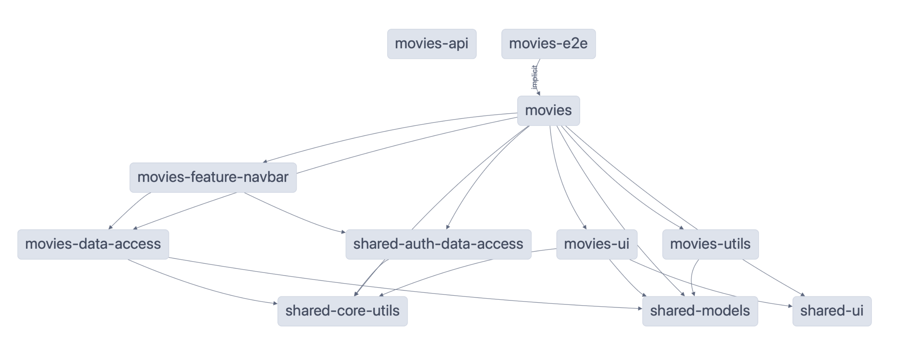
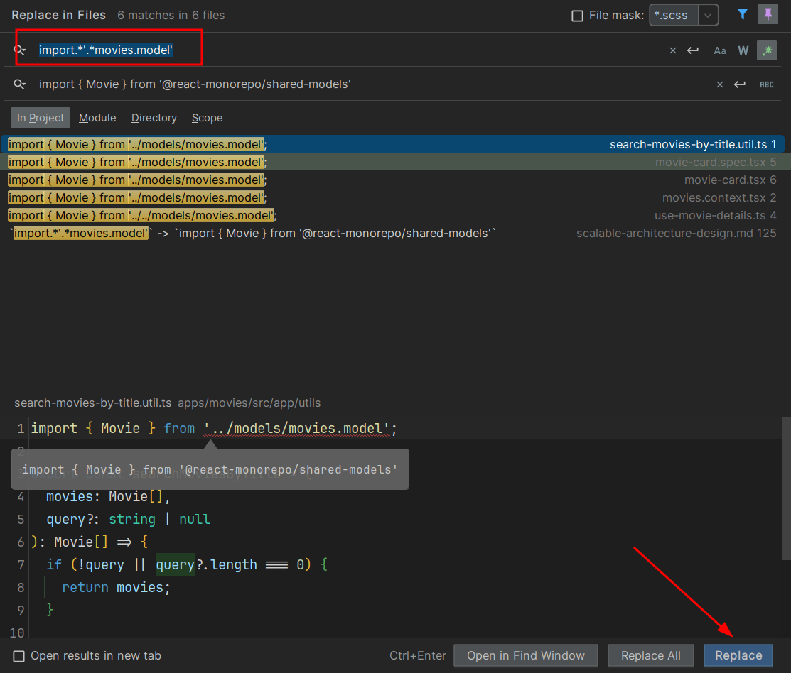
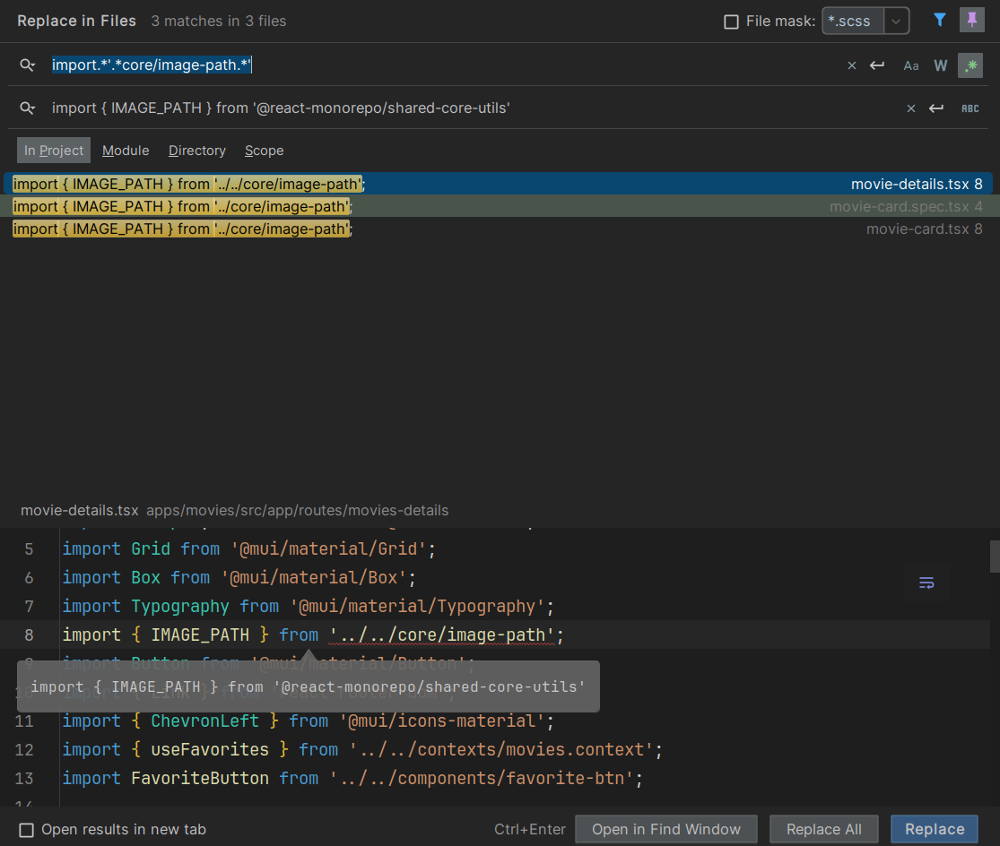

# Exercise: Nx Scalable Architecture Design

In this exercise we will learn how to create scalable architecture design using Nx.
We will create multiple libraries of all types (feature, data-access, ui, util) and scopes (movies, shared).

# Goal

In the end our project graph should look like this:



As we have to refactor a monolith to a scalable separated architecture, let's stick to the migration strategy discussed
before:

1. low hanging fruits 🍏: Code that doesn’t have any dependencies (mostly utils, models, types)
2. Move code that only depend on libraries (ui only, data-access)
3. Move features into feature libraries (pages, routing)

# 0. Project Setup

> [!NOTE]
> From here on, we are using the REAL project, not the one you have created in the exercises before
> Please make sure you have set it up properly, by following the instructions:
> 
> [PROJECT SETUP](./project-setup.md)

# IMPORTANT TIP(s)

## Solutions branch available

> [!TIP]
> If you feel like you don't want to refactor anymore, please go ahead and check out the full solution branch: `solutions/libs-arch`
> Of course it would be amazing if you create the whole structure yourself, but it might take too long for the scope of the workshop. So please
> just end the exercise whenever you feel like you don't want to refactor anymore.
> 
> `git switch -c ${YOUR_BRANCH_NAME} origin/solutions/libs-arch`

## Default settings for libraries

> [!TIP]
> You can try to introduce some buildable libraries if you like ;)

## COMMIT OFTEN

> [!TIP]
> You want to commit often. Please don't push to main, but commit locally.
> You anyway want to create a new branch later on. You can also just follow the [create-a-branch](create-a-branch.md)
> exercise right now and create it upfron.

# 1. Step by Step

We want to have the following folder structure in the end

```bash
apps/
    movies/
libs/
    movies/
        feature-navbar/
        feature-favorites-page/
        feature-home-page/
        feature-movie-detail/
        ui-movie-card/
        data-access/
        util-movie-search/
    shared/
        auth/
            data-access/
            feature-guarded-route/
            ui-not-authenticated-page/
        util-core/
        ui/
        models/
        feature-error-page/
```


## 1.1 Models & Utils

Create the following libraries:
* `shared-models`
* `shared-core-utils`

<details>
  <summary>Library creation for models & utils</summary>

```bash
npx nx generate @nx/react:library shared-models --directory=libs/shared/models

npx nx generate @nx/react:library shared-core-utils --directory=libs/shared/core-utils
```

</details>

### 1.1.0 Check out the new paths

See the changes made to the `tsconfig.base.json`. They should show you the new paths configured for the 
libraries.

### 1.1.1 Move the model

Now it's time for the refactoring!
Move the `apps/movies/models/movie.model.ts` to the newly created `libs/shared/models` lib and export it
from the `index.ts` barrel file.

We suggest to **not** use the `search for references` option and break the existing imports.

<details>
  <summary>Move the model</summary>

```ts
// libs/shared/models/src/index.ts

export { Movie } from './movies.model';
```

</details>

### 1.1.2 Import fixing of model

Let's repair the imports with a simple trick!

Search & Replace with the following values:

`import.*'.*movies.model'` -> `import { Movie } from '@react-monorepo/shared-models'`



Yeeey! That should have worked.

### 1.1.3 Move the core-utils

Now it's time for the refactoring!
Move the contents of `apps/movies/core/` to the newly created `libs/shared/core-utils/src/` lib and export it
from the `index.ts` barrel file.

We suggest to **not** use the `search for references` option and break the existing imports.

<details>
  <summary>Move the utils</summary>

```ts
// libs/shared/core-utils/src/index.ts

export { IMAGE_PATH } from './image-path';
export { API_URL } from './api-url';

```

</details>

### 1.1.4 Import fixing of utils-core

Let's repair the imports with a simple trick!

Search & Replace with the following values:

`import.*'.*core/image-path.*'` -> `import { IMAGE_PATH } from '@react-monorepo/shared-core-utils'`
`import.*'.*core/api.*'` -> `import { API_URL } from '@react-monorepo/shared-core-utils'`



Yeeey! That should have worked.

### 1.1.5 Check out the project graph!

Run the `nx graph` and take a look and your beautiful new libraries being imported.

## 1.2 Shared Ui

Create the following library:

* `shared-ui`

We want to put the `favorite-btn.tsx` into the newly created shared library, as it has no other dependency and
is just a generic component.

<details>
  <summary>Library creation for shared ui</summary>

```bash
npx nx generate @nx/react:library shared-ui --directory=libs/shared/ui
```

</details>


### 1.2.1 Move the favorite button to shared-ui

Now it's time for the refactoring!
Move the `apps/movies/components/favorite-btn.tsx` & `apps/movies/components/favorite-btn.spec.tsx` to the newly created `libs/shared/ui/src/` lib and export it
from the `index.ts` barrel file.

We suggest to **not** use the `search for references` option and break the existing imports.

<details>
  <summary>Move the shared ui</summary>

```ts
// libs/shared/ui/src/index.ts

// sorry for this!
import FavoriteButton from './favorite-btn';

export { FavoriteButton };

```

</details>

### 1.2.2 Import fixing of shared-ui

Let's repair the imports with a simple trick!

Search & Replace with the following values:

`import.*'.*favorite-btn.*'` -> `import { FavoriteButton } from '@react-monorepo/shared-ui'`

Yeeey! That should have worked.

### 1.2.3 Check out the project graph!

Run the `nx graph` and take a look and your beautiful new libraries being imported.

## 1.3 Movie data-access

Create the following libraries:
* `movies-data-access`

We want to put the `movies.context.tsx` into the newly created scoped library, as it tied to the movies app itself.

<details>
  <summary>Library creation for movies-data-access</summary>

```bash
npx nx generate @nx/react:library movies-data-access --directory=libs/movies/data-access 
```

</details>


### 1.3.1 Move the movies.context to movies-data-access

Now it's time for the refactoring!
Move the `apps/movies/contexts/movies.context.tsx` to the newly created `libs/movies/data-access/src/` lib and export it
from the `index.ts` barrel file.

We suggest to **not** use the `search for references` option and break the existing imports.

<details>
  <summary>Move the movies.context</summary>

```ts
// libs/movies/data-access/src/index.ts

export { MovieProvider, useMovies, useFavorites } from './movies.context';

```

</details>

### 1.3.2 Import fixing of movies.context

Let's repair the imports with a simple trick!

Search & Replace with the following values:

`'.*movies.context.*'` -> `'@react-monorepo/movies-data-access'`

Yeeey! That should have worked.

### 1.3.3 Check out the project graph!

Run the `nx graph` and take a look and your beautiful new libraries being imported.

## 1.4 Play around with different commands that affect multiple projects

E.g.

```bash
nx run-many -t test

nx run-many -t lint
```

> [!NOTE]
> The affected commands are likely to not work you expect. It is possible to make it work for you, by
> following the [create-a-branch](./create-a-branch.md) exercise. You will anyway be required to do so!
> Have fun

# 2. The hard way:

- Create library for shared models
  - Movie (`apps/movies/src/app/models/movies.model.ts`)
- Create library for shared core utils for API_URL & IMAGE_PATH environment variables
- Create library for shared auth data-access (`apps/movies/src/app/contexts/auth.context.tsx`)
- Create library for movies utils for searchMoviesByTitle (`apps/movies/src/app/utils/search-movies-by-title.util.ts`)
- Create library for shared ui favorite-btn (`apps/movies/src/app/components/favorite-btn.tsx`)
- Create library for movies data-access (`apps/movies/src/app/contexts/movies.context.tsx`)
- Create library for shared auth data-access (`apps/movies/src/app/contexts/auth.context.tsx`)
- Create library for movies ui movie-card (`apps/movies/src/app/components/movie-card.tsx`)
- Create library for movies feature navigation bar (`apps/movies/src/app/layout/navbar`)

- After creating all the libraries, make sure that the application is still working as expected.
- Run `nx graph` and see how the dependencies are connected between the libraries and the application.

### 2.1 Create libraries for all things we need

First, create all libraries that we need for our application. And then we can migrate the code from the app to the libraries, and also fix the imports.

```bash
npx nx generate @nx/react:library --name=shared-models --directory=libs/shared/models 

npx nx generate @nx/react:library --name=shared-core-utils --directory=libs/shared/core-utils 
 
npx nx generate @nx/react:library --name=shared-ui --directory=libs/shared/ui 

npx nx generate @nx/react:library --name=movies-ui --directory=libs/movies/ui  

npx nx generate @nx/react:library --name=movies-utils --directory=libs/movies/utils  

npx nx generate @nx/react:library --name=shared-auth-data-access --directory=libs/shared/auth  

npx nx generate @nx/react:library --name=movies-data-access --directory=libs/movies/data-access 

npx nx generate @nx/react:library --name=movies-feature-navbar --directory=libs/movies/feature-navbar 
```

### 2.2 Move core utils to shared-core-utils

- Move the `api-url.ts` and `image-path.ts` files from `apps/movies/src/app/core` to `libs/shared/core-utils/src`.
- Export all their content from the `index.ts` file.
  ```ts index.ts
  export * from './api-url';
  export * from './image-path';
  ```
- Replace all broken imports with the new path `@react-monorepo/shared-core-utils`.
  Example:
  ```diff
  - import { API_URL } from '../core/api-url';
  + import { API_URL } from '@react-monorepo/shared-core-utils';
  ```
### 2.3 Move ui favorite-btn to shared-ui

- Move the `favorite-btn` folder from `apps/movies/src/app/components` to `libs/shared/ui/src`.
- Export the `favorite-btn` folder from the `index.ts` file.
- Replace all broken imports with the new path `@react-monorepo/shared-ui`.
  - Example:
  ```diff
  - import FavoriteButton from './favorite-btn';
  + import { FavoriteButton } from '@react-monorepo/shared-ui';
  ``` 

### 2.4 Move ui movie-card to movies-ui

- Move the `movie-card` folder from `apps/movies/src/app/components` to `libs/movies/ui/src`.
- Export the `movie-card` folder from the `index.ts` file.
- Replace all broken imports with the new path `@react-monorepo/movies-ui`.

  - Example:
  ```diff
  - import MovieCard from '../components/movie-card';
  + import { MovieCard } from '@react-monorepo/movies-ui';
  ```
- Update the imports to use:
  - `Movie` from `@react-monorepo/shared-models`.
  - `IMAGE_PATH` from `@react-monorepo/shared-core-utils`.
  - `FavoriteButton` from `@react-monorepo/shared-ui`.

### 2.5 Move movies.context.tsx to movies-data-access

- Move the `movies.context.tsx` file from `apps/movies/src/app/contexts` to `libs/movies/data-access/src`.
- Export the `movies.context.tsx` file from the `index.ts` file.
- Replace all broken imports with the new path `@react-monorepo/movies-data-access`.

  Example:
  ```diff
  - import { useFavorites, useMovies } from '../contexts/movies.context';
  + import { useFavorites, useMovies } from '@react-monorepo/movies-data-access';
  ```
- Update the imports to use:
  - `Movie` from `@react-monorepo/shared-models`.
  - `API_URL` from `@react-monorepo/shared-core-utils`.

### 2.6 Move auth data-access to shared-auth-data-access

- Move the `auth.context.tsx` file from `apps/movies/src/app/contexts` to `libs/shared/auth/src`.
- Export the `auth.context.tsx` file from the `index.ts` file.
- Replace all broken imports with the new path `@react-monorepo/shared-auth-data-access`.

  Example:
  ```diff
  - import { AuthContext } from '../contexts/auth.context';
  + import { AuthContext } from '@react-monorepo/shared-auth-data-access';
  ```
- Update the imports to use:
  - `Movie` from `@react-monorepo/shared-models`.

### 2.7 Move feature navbar to movies-feature-navbar

- Move the `navbar` folder from `apps/movies/src/app/layout` to `libs/movies/feature-navbar/src`.
- Export the `navbar` folder from the `index.ts` file.
- Replace all broken imports with the new path `@react-monorepo/movies-feature-navbar`.

  Example:
  ```diff
  - import ResponsiveAppBar from '../layout/navbar';
  + import { ResponsiveAppBar } from '@react-monorepo/movies-feature-navbar';
  ```   

- Update the imports to use:
  - `AuthContext` from `@react-monorepo/shared-auth-data-access`.
  - `useFavorites` from `@react-monorepo/movies-data-access`.

